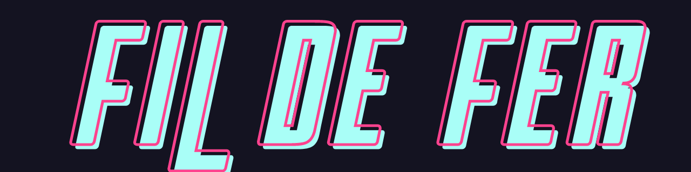

     

# FDF

This project is about creating a simple wireframe model representation of a 3D landscape by linking various points (x, y, z) thanks to line segments (edges).
The only external library that is allowed is `MLX42`, available [here](https://github.com/codam-coding-college/MLX42) on GitHub, created and maintained by [Codam](https://www.codam.nl/en/), member of the [42 Network](https://www.42network.org/). 
The full subject can be found [here](.media/en.subject.pdf).
